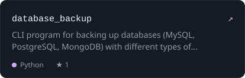
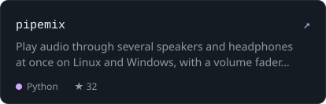
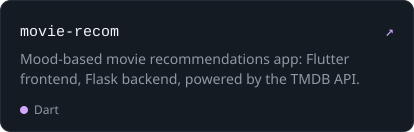

  
  

  
  

  <a href="https://www.linkedin.com/in/garvit-agrawal7/"><code>linkedin ↗</code></a>&nbsp;
  <a href="https://github.com/Garvit-Agrawal7?tab=repositories"><code>all repos ↗</code></a>&nbsp;
  <code>Rajasthan, India · IST (UTC+5:30)</code>

